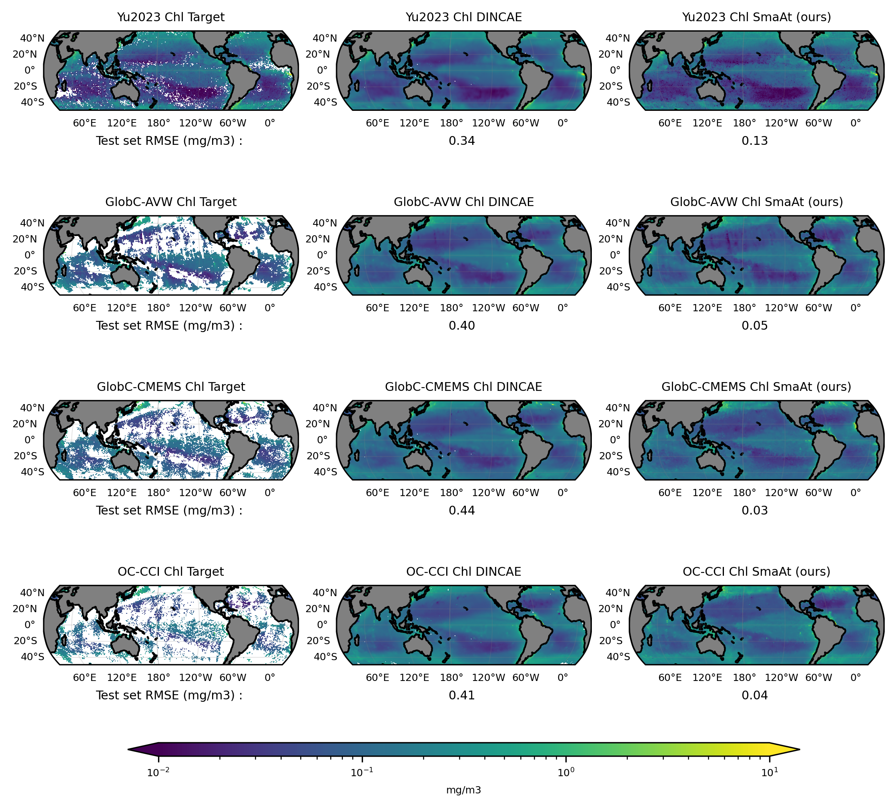

 


# SmaAT_UNet for gap completion of satellite chlorophyll-a and pigment based phytoplankton classes.


SmaAt_UNet is a neural network to
reconstruct missing data in satellite observations which is described in the following open access paper:
https://doi.org/10.48550/arXiv.2007.04417

The reconstruction use physical variables from [GLorysV12](https://data.marine.copernicus.eu/product/GLOBAL_MULTIYEAR_PHY_001_030/description) and [Era5 reanalysis](https://cds.climate.copernicus.eu/datasets/reanalysis-era5-single-levels?tab=overview)


## Installation

Python > 3.7 with the modules:
* numpy (https://docs.scipy.org/doc/numpy/user/install.html)
* xarray (https://docs.xarray.dev/en/stable/)
* pytorch (https://pytorch.org/get-started/locally/)
* dask (https://docs.dask.org/en/stable/)

Tested versions:

* Python 3.11.8


You can install those packages either with `pip3` or with `conda`.


## Documentation

Use the `config.py` file to set the training parameters (see the `.\configs` folder for example configurations).
The weights of the trained network are available in the weights folder.

Various datasets have been completed :
* [OC-CCI](https://climate.esa.int/en/projects/ocean-colour/)
* [Yu2023](https://www.frontiersin.org/journals/marine-science/articles/10.3389/fmars.2023.1051619/full)
* [GlobC-AVW](https://hermes.acri.fr/)
* [GlobC-Cmems](https://data.marine.copernicus.eu/product/OCEANCOLOUR_GLO_BGC_L4_MY_009_104/description)


## Input format

The input data should be in netCDF with the variables:
* `lon`: longitude (degrees East)
* `lat`: latitude (degrees North)
* `time`: time (days since 1900-01-01 00:00:00)

The network has been trained on global 1° resolution data but should work with other resolutions if retrained.

This is the example output from `ncdump -h`:

```
dimensions:
	time = UNLIMITED ; // (9496 currently)
	lon = 360 ;
	lat = 180 ;
variables:
	double time(time) ;
		time:standard_name = "time" ;
		time:units = "days since 1998-01-01 00:00:00" ;
		time:calendar = "proleptic_gregorian" ;
		time:axis = "T" ;
	float lon(lon) ;
		lon:axis = "X" ;
	float lat(lat) ;
		lat:axis = "Y" ;
	float CHL(time, lat, lon) ;
		CHL:_FillValue = NaNf ;
		CHL:missing_value = NaNf ;
	float Micro(time, lat, lon) ;
		Micro:_FillValue = -9.e+33f ;
		Micro:missing_value = -9.e+33f ;
	float Nano(time, lat, lon) ;
		Nano:_FillValue = -9.e+33f ;
		Nano:missing_value = -9.e+33f ;
	float Pico(time, lat, lon) ;
		Pico:_FillValue = -9.e+33f ;
		Pico:missing_value = -9.e+33f ;

// global attributes:
		:CDI = "Climate Data Interface version 2.0.4 (https://mpimet.mpg.de/cdi)" ;
		:Conventions = "CF-1.6" ;

```


## Running SmaAt_UNet

To run several different `config.py` files you can use the the `run_config.sh` file,
otherwise you can directly launch the current configuration via the `main.py` file.

To reproduce the results, you can use the configuration saved into the `weight` folder, load the trained weight for the desired data
and run the network on the testdata.


## Example results

For more precision on the results, you can check in review paper 
North-South asymmetry in subtropical phytoplankton response to recent warming 
(TO DO - add DOI and link when available)

